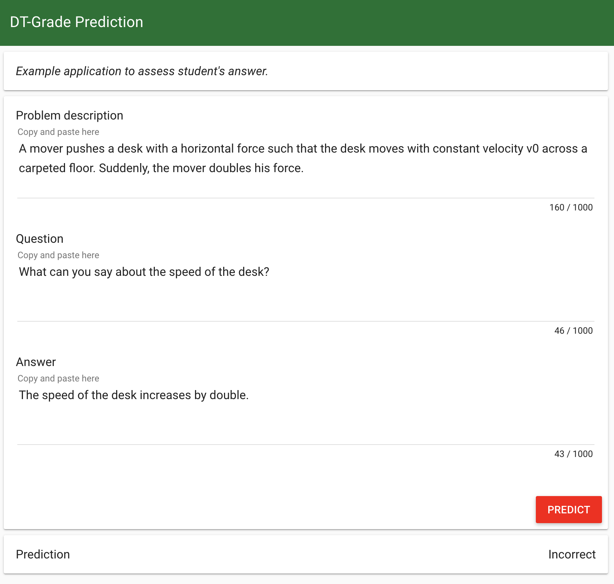

# DT-Grade Prediction


# Overview

This repo contains a set of tools to illustrate a machine learning system designed to assess a student's answer to question.  
Data comes from the DT-Grade corpus containing student answers to conceptual questions related to 9 problems in the area of Newtonian physics.

The core functionalities provided are:
* Data preparation and pre-processing (train, test, landmarks)
* Basic feature engineering relying mainly on text similarities
* Machine learning model training and evaluation
* A Web-based demo that runs an ML model via a Flask REST API


# Install
The required Python packages for executing the scripts in this repository are listed in requirements.txt.  
We recommand using Python >= 3.5 and the standard virtualenv tool.  

You may need to ugrade the Python package manager pip before installing the required packages:
```
$ pip install --upgrade pip
```

At the terminal, run the following command to create a virtual environment.
```
$ virtualenv env
```

Activate the environment: 
```
$ source env/bin/activate
```

Install the necessary python packages:
```
$ pip install -r requirements.txt
```


# Data
The DT-Grade corpus consists of short constructed answers extracted from tutorial dialogues between students and a state-of-the-art conversational Intelligent Tutoring System (ITS) called DeepTutor (Ruset al., 2013; Rus et al., 2015).  
The student responses were annotated for their correctness in the given context and whether the contextual information was useful.  
The dataset contains 900 answers (of which about 25% required contextual information to properly interpret them).  

The data was downloaded in the /data directory of this repository.  
You can [download](http://deeptutor.memphis.edu/downloads/DT-Grade%20v1.0.zip) the dataset from the Deep Tutor website.


# Pre-processing
The original data comes in XML format (grade_data.xml).  
Run the pre-processing script to split the data into 10% landmarks, 70% train and 20% test sets.  
The script computes a numerical representation of all reference answers as well as student answers in the landmarks set.  
We use the Gensim Python library combined with general word embeddings that were pre-trained on Google News to generate an embedding vector for each answer.  
You need to download the Google News word embeddings and save them to disk:
```
$ curl https://s3.amazonaws.com/dl4j-distribution/GoogleNews-vectors-negative300.bin.gz --output data/GoogleNews-vectors-negative300.bin.gz
$ gunzip -k -v data/GoogleNews-vectors-negative300.bin.gz
```
Run the pre-processing script:
```
$ python preprocess.py
```
This will create data files in /munge directory.
* train.csv: student response instances for training and cross-validation
* test.csv: student response instances for test
* landmarks.txt: landmark instances with pre-computed embeddings

> Note  
In the landmarks text file, a hash key was generated to identify each problem and question.  
This will help make the lookup when featurizing a new instance with its similarity to landmarks of same question.


# Model Training and Evaluation
All the steps regarding the feature engineering, model training and evaluation are detailed in a jupyter notebook.  
**Model Training and Evaluation.ipynb**  

We train a multinomial logistic regression using the kernel trick (features in the softmax regression are similarity scores between instances and pre-defined landmarks.)  
We think that kernel methods can be powerful in such configuration where the number of observations in the training set is low.  
The intuition is that we can help decide an assessment by comparing a new student answer to reference answers and to other student answers which were previously evaluated.  
We penalize the model using a 10-fold cross-validation strategy to maximize the number of observations used for training.  
The performance of the system is measured using the global accuracy and the F1-score on each class.


# Web Demo
You can test the prediction by running the web app:
```
$ python app.py
```
You need to copy and paste the following text items:
* problem description as written in the original data
* question as written in the original data
* free student answer

The model will predict "Unknown" if the problem description and question are not in the scope of landmarks (never seen before).  
Otherwise, we get a prediction in the following list:  
*Correct | Correct but incomplete | Contradictory | Incorrect*



# Quick Links
* DT-Grade Paper: [Evaluation Dataset (DT-Grade) and Word Weighting Approach towards Constructed Short Answers Assessment in Tutorial Dialogue Context](https://pdfs.semanticscholar.org/684f/a5e6cfd37f73732d517c3586379c1ab3c117.pdf)
* Deep Tutor Resources: http://deeptutor.memphis.edu/resources.htm